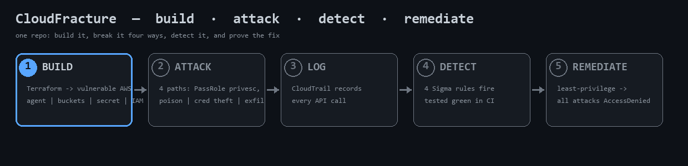
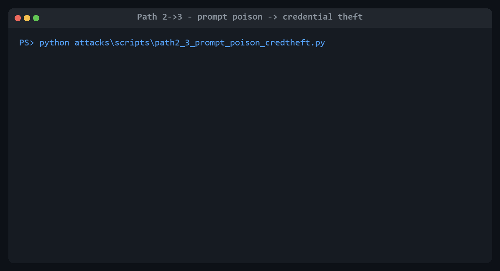
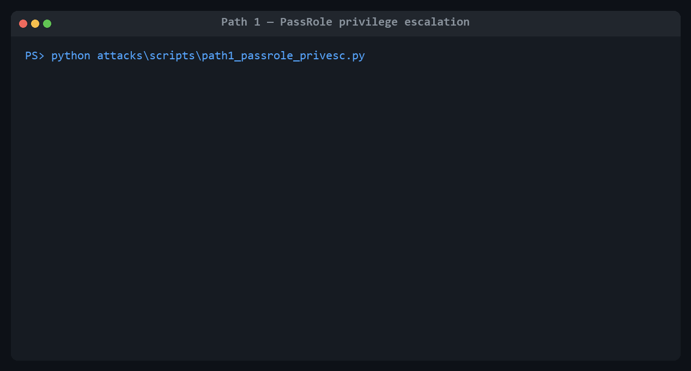
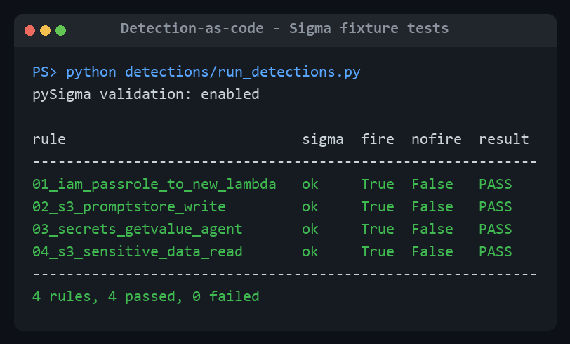
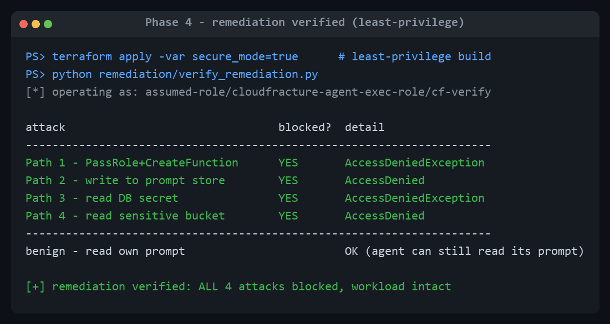

# CloudFracture

**Attacking and detecting identity abuse in AWS AI workloads.**

A deliberately vulnerable LLM-agent workload on AWS, built as code — then
compromised across four identity-based attack paths, detected with tested
detection-as-code, remediated to least-privilege, and shipped through an AppSec CI
pipeline. Every attack is real and reproducible; every claim has evidence.

> One sentence: *I built a vulnerable LLM-agent workload on AWS as code, exploited
> four identity attack paths from the agent's execution role to data exfiltration
> and prompt-store poisoning, wrote tested Sigma detections for each, remediated
> the IAM to least-privilege and proved the attacks then fail, and shipped it
> through CI with SAST, SCA, secret scanning, IaC scanning and an SBOM.*

> ⚠️ **Intentionally insecure.** Never deploy to an account with anything real.
> `terraform destroy` after every session. Everything here runs on a dedicated,
> throwaway account for < €10 total.

---

## The whole project in one loop



Build a realistic flaw → exploit it with evidence → detect it with a test that
fails when the detection breaks → close it with least privilege → prove the close.
All as code, all reproducible.

---

## The attack, end to end

A poisoned prompt store turns a benign question into credential theft — the agent
reads a secret it should never touch and leaks it in its own reply:



Privilege escalation via `iam:PassRole` — a role *denied* `iam:ListRoles` creates a
Lambda that runs as the privileged role and lists every role in the account:



---

## Threat model (one screen)

**Asset:** an enterprise-style AI agent (local Python runtime + a local Ollama LLM)
that reads data, reads a DB credential, and acts on AWS as `agent-exec-role`.
**Trust boundaries:** client→agent, agent→prompt store, agent→tools/AWS, agent→IAM.

Five deliberate flaws, each documented as intentional in [`terraform/iam.tf`](terraform/iam.tf):

| # | Flaw | Enables | STRIDE |
|---|------|---------|--------|
| 1 | `agent-exec-role` has `iam:PassRole` on `privileged-role` + `lambda:CreateFunction` | Path 1 | Elevation of Privilege |
| 2 | `agent-exec-role` uses wildcard actions + `Resource "*"` on S3 / Secrets | Paths 3, 4 | Information Disclosure |
| 3 | `privileged-role` trust allows `lambda.amazonaws.com` + account root | Path 1 | Spoofing / EoP |
| 4 | `prompt-store` bucket policy lets the agent role `PutObject` | Path 2 | Tampering |
| 5 | `db-creds` secret resource policy grants the agent role `GetSecretValue` | Path 3 | Information Disclosure |

Full STRIDE analysis + residual risk: [`THREAT_MODEL.md`](THREAT_MODEL.md).

---

## The four attack paths

Each path → PoC → evidence → detection → remediation. Framework mapping:
[`mappings/attack-atlas-owasp.md`](mappings/attack-atlas-owasp.md).

| # | Path | Technique | Writeup |
|---|------|-----------|---------|
| 1 | **PassRole privilege escalation** | `iam:PassRole` + `CreateFunction` → run as privileged role · ATT&CK T1548 / T1078.004 | [01](attacks/01-passrole-privesc.md) |
| 2 | **Prompt-store poisoning** | persisted injection into the agent's system prompt · OWASP LLM01 · ATLAS | [02](attacks/02-promptstore-poison.md) |
| 3 | **Credential theft via tools** | poisoned agent reads + leaks the DB secret · OWASP LLM06 · ATT&CK T1552 | [03](attacks/03-cred-theft.md) |
| 4 | **Data exfiltration** | agent reads the sensitive-data bucket · ATT&CK T1530 / TA0010 | [04](attacks/04-data-exfil.md) |

The AI-native paths (2, 3) are the differentiator. Honest finding: prompt-injection
compliance on a small local model is **variable** (measured 0% for naive "override"
injection, 20–100% for task-coupled), and when the tool fires it leaks every time —
[`experiments/ollama-injection-test/RESULTS.md`](experiments/ollama-injection-test/RESULTS.md).

---

## Detection-as-code (tested, not linted)

Four Sigma rules, one per path, each **executed** against fire/no-fire CloudTrail
fixtures in CI — a rule ships only when it catches its attack *and* stays quiet on
benign activity:



Rules: [`detections/sigma/`](detections/sigma) · runner:
[`detections/run_detections.py`](detections/run_detections.py) · fixture provenance
(real vs constructed): [`detections/fixtures/PROVENANCE.md`](detections/fixtures/PROVENANCE.md).

---

## Remediation — proving the fix

The same stack applies vulnerable *or* least-privilege (`-var secure_mode=true`).
Re-running all four attacks against the remediated stack: every one denied, and the
agent still works.



Before/after IAM diffs per flaw: [`remediation/iam-diffs/`](remediation/iam-diffs/README.md).

---

## AppSec / supply chain

One GitHub Actions pipeline ([`.github/workflows/ci.yml`](.github/workflows/ci.yml)):

| Stage | Tool |
|---|---|
| Detection tests | pySigma fixture runner |
| SAST | Semgrep |
| SCA | pip-audit |
| Secret scanning | Gitleaks |
| IaC scanning | Checkov + tfsec (intentional flaws suppressed with [justification](docs/checkov-suppressions.md)) |
| SBOM | Syft (CycloneDX) |

---

## Architecture & layout
```
terraform/     vulnerable workload as code (iam.tf = the 5 flaws; secure_mode toggle)
agent/         local agent runtime — assumes agent-exec-role, Ollama tool-loop
attacks/       one writeup + PoC + evidence per path
detections/    Sigma rules + fixtures + pySigma runner + GuardDuty mapping
remediation/   least-privilege diffs + verifier (re-attacks the fixed stack)
experiments/   Week-1 prompt-injection viability study
mappings/      ATT&CK Cloud / ATLAS / OWASP per path
.github/       CI: SAST, SCA, secrets, IaC, SBOM, detection tests
```

## Build status
Phases 0–4 complete. All four attacks proven, detections tested + green, remediation
verified on real AWS. Remaining: GitHub publish + CI green-on-push + blog series.
GuardDuty capture is scripted but blocked on the lab account
([details](detections/guardduty/README.md)); the Sigma layer already covers all paths.

## Run it
Plain-English, staged setup (accounts, installs, safety): [`SETUP.md`](SETUP.md).
Apply / verify / destroy runbook: [`specs/001-vulnerable-workload/quickstart.md`](specs/001-vulnerable-workload/quickstart.md).

## Disclaimer
For education and authorized security research only. Contains intentionally
vulnerable infrastructure and working exploit code. Deploy only to a dedicated,
isolated account you own.
