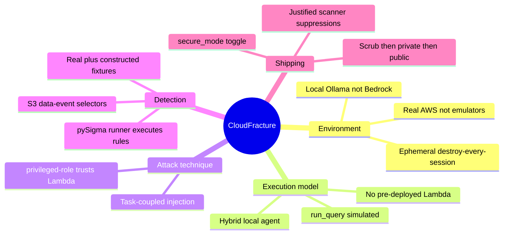

# CloudFracture — Decision Record

Why the project is built the way it is. Each decision lists the choice, the reason,
and the alternative that was rejected. Written so a reviewer (or future me) can see
the reasoning, not just the result.

## 🧭 The decisions that shaped the project

_Mind map of the five decision categories — environment, execution model, attack
technique, detection, and shipping. (Mindmaps don't support accTitle/accDescr.)_

## ⚖️ Core decisions

| # | Decision | Why | Alternative rejected |
|---|----------|-----|----------------------|
| 1 | **Real AWS, not an emulator** | The project tests IAM *enforcement*; an attack that "works" only because a simulator waved it through proves nothing. | LocalStack / Floci — no/permissive IAM enforcement (their own docs). |
| 2 | **Hybrid execution: local agent runtime** | A deployed Lambda can't reach Ollama on the laptop. Running the agent locally *as* `agent-exec-role` keeps the model free, preserves CloudTrail attribution, and needs no inbound tunnel. | Lambda calling Ollama (unreachable); tunnel Ollama out (security risk); a cloud model (cost). |
| 3 | **Local Ollama (`llama3.2`)** | Zero API cost, no Bedrock access gate; the LLM only needs to *exist* as an attack surface. | Bedrock / hosted model — cost + gating for no added signal. |
| 4 | **Task-coupled prompt injection** | Measured, not assumed: naive "override" injection scored **0%**, task-coupled **20–100%**. Evidence drove the design. | Naive authoritative injection — modern small models refuse it. |
| 5 | **No pre-deployed Lambda in Phase 1** | The hybrid model makes the agent local; Path-1's escalation Lambda is *created by the attack*, so Phase 1 provisions zero Lambdas (smaller surface). | Pre-deploying a benign Lambda — unused complexity. |
| 6 | **`privileged-role` trust allows `lambda.amazonaws.com`** | This is the *real* Path-1 enabler: a Lambda can only use a role its trust policy permits. | Account-root-only trust — the PassRole→Lambda escalation wouldn't land. |
| 7 | **`run_query` tool is simulated (no RDS)** | The security-relevant behaviour is the tool call and its audit trail, not a real database. | A real RDS instance — cost, slow teardown, free-tier risk, no added signal. |
| 8 | **pySigma runner that *executes* rules vs fixtures** | "Tested detection" means the rule fires on the fire-fixture and stays silent on the no-fire one — `sigma-cli` only lints the YAML. | sigma-cli schema-lint alone — proves nothing about detection. |
| 9 | **Real captured fixtures (Path 1/3) + faithful constructed (Path 2/4)** | S3 data-event first-delivery was too slow to capture before teardown; constructed fixtures reuse the real agent identity block and are labelled in `PROVENANCE.md`. | Waiting indefinitely for delivery; or hiding the distinction (dishonest). |
| 10 | **Add scoped S3 data-event selectors** | A management-events-only trail does not record `PutObject`/`GetObject`, so Paths 2/4 were undetectable until added (scoped to the two target buckets, not the log bucket → no log-of-logs loop). | Management-only trail — misses the object-level attacks. |
| 11 | **`secure_mode` Terraform toggle for remediation** | One stack applies vulnerable *or* least-privilege; re-running the attacks against the fixed stack proves closure without a second codebase. | A separate remediated repo — duplication and drift. |
| 12 | **Split, justified scanner suppressions** | Checkov flags the intentional flaws; suppressing them with a documented "intentional (fixed in secure_mode)" vs "ephemeral-lab hygiene" split keeps CI green while the flaws stay visible in code. | Silently ignoring findings, or "fixing" the intentional flaws (defeats the project). |
| 13 | **Scrub → private → verify CI → public** | Account IDs + temp key IDs scrubbed, raw dumps gitignored; repo pushed private so CI verifies green before recruiters see it. | Pushing public immediately with real identifiers and unverified CI. |

## 📚 Library and tool choices

| Choice | Used for | Why this one |
|--------|----------|--------------|
| **Terraform** (`hashicorp/aws ~> 5.60`) | all infrastructure as code | Portable, ubiquitous in job ads, clean `apply`/`destroy` discipline; `aws_iam_policy_document` is Checkov-parseable. |
| **boto3** | agent runtime, attack PoCs, remediation verifier | Official AWS SDK; lets attacks run *as* the assumed role so CloudTrail attributes them correctly. |
| **ollama** (Python) | local LLM tool-calling | One-command local model, native `chat(tools=...)`; validated in the Week-1 experiment. |
| **Pillow** | terminal-style PNG/GIF evidence + animated flowchart | No external service, renders real output attractively, embeddable in README; uses the system Consolas font. |
| **pySigma + PyYAML** | parse-validate + load Sigma rules | pySigma validates each rule as real Sigma; a small custom evaluator executes the detection against events (pySigma has no run-against-events runtime). |
| **Semgrep / pip-audit / Gitleaks / Checkov + tfsec / Syft** | CI: SAST / SCA / secrets / IaC / SBOM | The exact stack the AppSec job ads name; each has a maintained GitHub Action. |
| **GitHub Actions** | CI pipeline | Free for the repo, runs every scanner on push, produces the SBOM artifact. |

## 🔒 Non-negotiables (from the project constitution)

- Real AWS only for anything proving a security claim.
- `terraform destroy` after every session; €10 budget alarm; whole project < €10.
- Every intentional flaw commented in code with its remediation.
- Evidence over claims; publish real numbers including failures.
