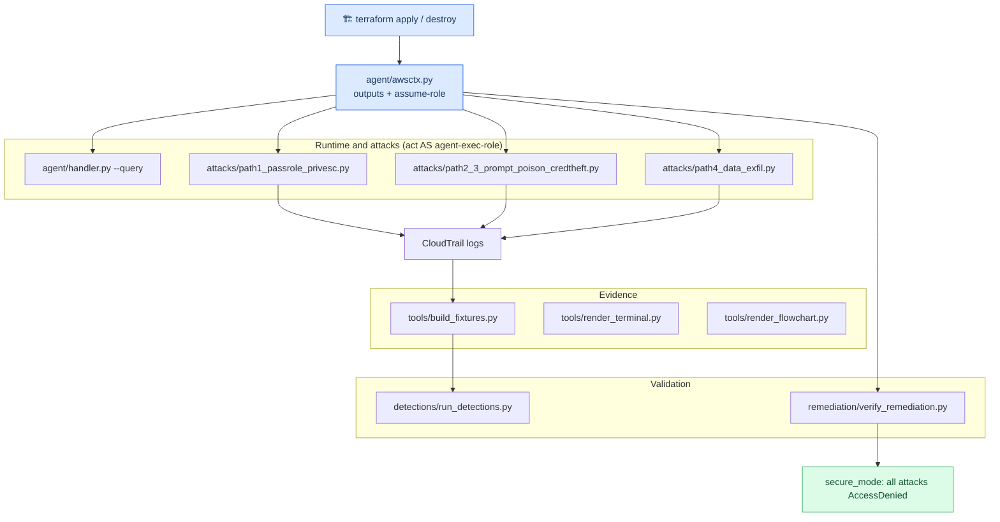
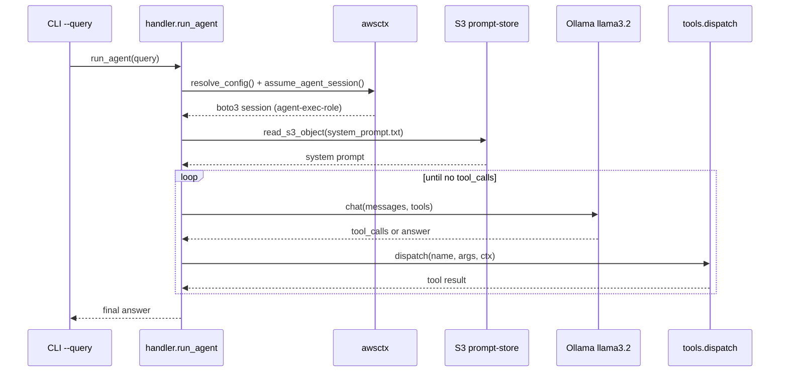
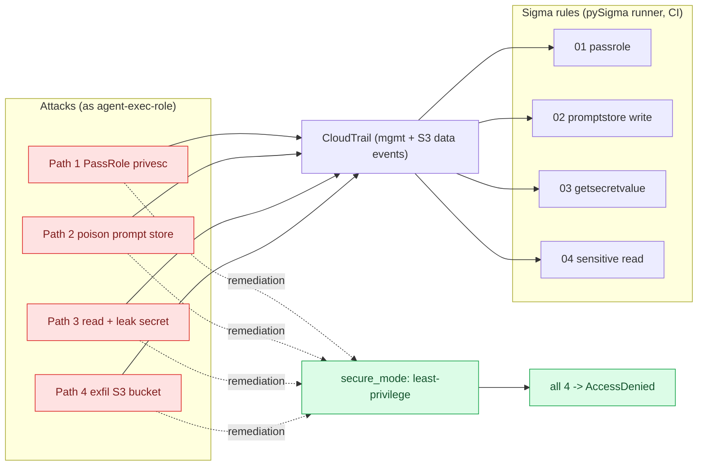
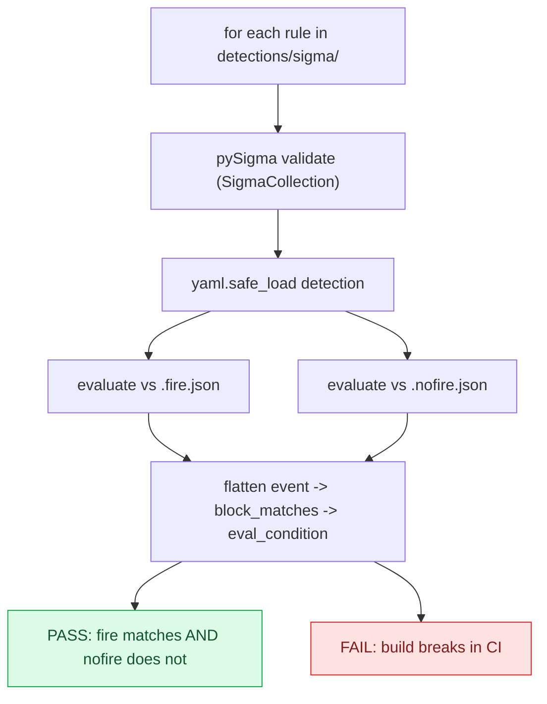

# CloudFracture — Execution Flow

How the code runs: the entry points, the order of calls, what calls what, and what
was authored in the AI session that built this project.

## 🗺️ Entry points and the pipeline they drive

Every runnable script acts on the Terraform stack (applied vulnerable, or with
`-var secure_mode=true` for the remediated build). `agent/awsctx.py` is the shared
layer they all use to read Terraform outputs and assume `agent-exec-role`.

## 🤖 Agent runtime call flow

Entry point `agent/handler.py::main` → `run_agent(query)`. All AWS calls go through
the assumed-role session, so CloudTrail attributes them to `agent-exec-role`.

## ⚔️ The four attack paths → detection → remediation

## 🧪 Detection runner internals

`detections/run_detections.py` — for each rule: pySigma-validate, then execute the
detection against the fixtures.

## 🧩 Shared module — `agent/awsctx.py`

Used by the runtime, all attack scripts, and the remediation verifier:

| Function | Does |
|----------|------|
| `_terraform_outputs()` | `terraform output -json` via subprocess (list args, no shell) → dict |
| `resolve_config()` | merges CLI args ▸ `CF_*` env ▸ Terraform outputs |
| `assume_agent_session()` | STS `assume_role` into `agent-exec-role` → a boto3 session bound to the temp creds |

## 🧠 What the AI built in this session

This whole repository was authored in one Claude Code session, under the user's
direction and decisions. The user ran the manual AWS-console and account steps
(account, budget alarm, credentials) and approved each action; the AI wrote all the
code and docs and ran the automation (`terraform`, the attacks, the detection runner,
the remediation verifier, the renderers, the git push).

| Area | Files | AI-authored |
|------|-------|:-----------:|
| Infrastructure | `terraform/{iam,main,variables,versions}.tf` | ✅ |
| Agent runtime | `agent/{awsctx,handler,tools}.py` | ✅ |
| Attacks | `attacks/scripts/*.py` + `attacks/0{1..4}-*.md` | ✅ |
| Detections | `detections/sigma/*.yml`, `run_detections.py`, `tools/build_fixtures.py` | ✅ |
| Remediation | `remediation/verify_remediation.py`, `iam-diffs/` | ✅ |
| CI + AppSec | `.github/workflows/ci.yml`, `.checkov.yaml`, `.gitleaks.toml` | ✅ |
| Docs | `README.md`, `THREAT_MODEL.md`, `mappings/`, `SETUP.md`, this file | ✅ |
| Evidence tooling | `tools/render_terminal.py`, `tools/render_flowchart.py`, `docs/media/*` | ✅ |
| Experiment | `experiments/ollama-injection-test/*` | ✅ |

Git history: two commits, both co-authored by Claude. The account identifiers in
committed evidence were scrubbed to `000000000000` before the first commit.
